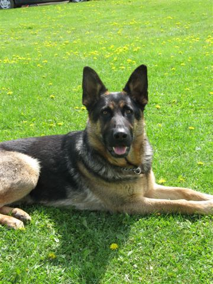
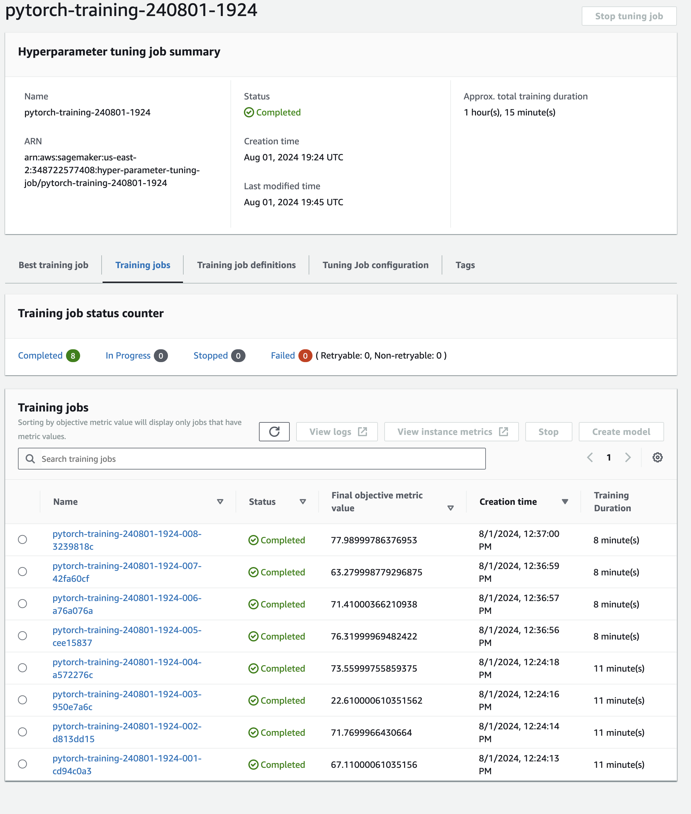
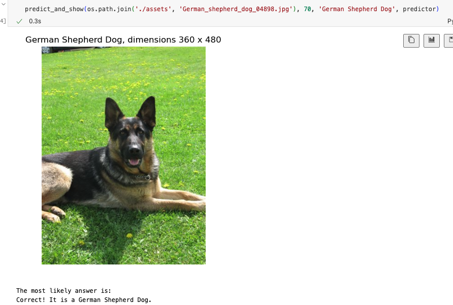
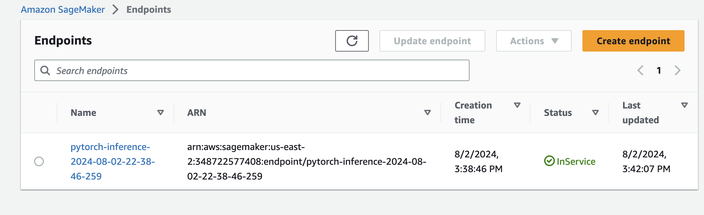

# Image Classification using AWS SageMaker

Use AWS Sagemaker to train a pretrained model that can perform image classification by using the Sagemaker profiling, debugger, hyperparameter tuning and other good ML engineering practices. This can be done on either the provided dog breed classication data set or one of your choice.

## Project Set Up and Installation
Enter AWS through the gateway in the course and open SageMaker Studio. 
Download the starter files.
Download/Make the dataset available. 

## Dataset
The provided dataset is the dogbreed classification dataset which can be found  [here](https://s3-us-west-1.amazonaws.com/udacity-aind/dog-project/dogImages.zip). 
The dataset contains 
* 133 total dog categories. 
* 8364 total images.
* 6681 training images.
* 835 validation images.
* 848 test images.

For example: 



The images differ in dimensions and in size.

### Access
Upload the data to an S3 bucket through the AWS Gateway so that SageMaker has access to the data. 

__Adam: I created a bucket named udacity-ml-aws where I uploaded the data.__

## Hyperparameter Tuning

For the pretrained model I chose resnet50 as it s a good model for image classification tasks. Furthermore, it seemed to strike a good balance betweeen the complexity of the model and the computational resources required to train it.

I used transfer learniing to fine-tune the model on the dog breed classification dataset. This involved freezing the weights of the pretrained model, and adding two fully connected layers on top of it. The first fully connected layer was determined by the hyperparameter tuning (ended with 512), and the second fully connected layer had 133 units (corresponding to the number of dog breeds in the dataset). 

I tried 8 different combinations of hyperparameters, including 
* learning rates between 0.00001 and 0.001
* batch sizes of 64 and 128
* dropout rates between 0.2-0.5
* adam and rmsprop optimizers
* 256 and 512 units in the first fully connected layer

I trained each model for 4 epochs, and used the validation loss as the metric to optimize for. The model with highest accuracy was chosen as the best model.

A screenshot of the 8 training jobs is shown below:
<p align="center">

</p>
 
 Here are the results of the hyperparameter tuning job:
[here](assets/summary_df.md)

| batch_size   |   dropout_rate | fc_layer_size   |   learning_rate | optimizer   | TrainingJobName                           | TrainingJobStatus   |   FinalObjectiveValue |   TrainingElapsedTimeSeconds |
|:-------------|---------------:|:----------------|----------------:|:------------|:------------------------------------------|:--------------------|----------------------:|-----------------------------:|
| "128"        |          0.5   | "512"           |     0.001       | "rmsprop"   | pytorch-training-240801-1924-008-3239818c | Completed           |                 77.99 |                          460 |
| "128"        |          0.5   | "256"           |     0.001       | "rmsprop"   | pytorch-training-240801-1924-007-42fa60cf | Completed           |                 63.28 |                          463 |
| "128"        |          0.473 | "512"           |     0.000119052 | "adam"      | pytorch-training-240801-1924-006-a76a076a | Completed           |                 71.41 |                          461 |
| "64"         |          0.492 | "256"           |     0.000840304 | "rmsprop"   | pytorch-training-240801-1924-005-cee15837 | Completed           |                 76.32 |                          460 |
| "128"        |          0.495 | "256"           |     0.000510019 | "rmsprop"   | pytorch-training-240801-1924-004-a572276c | Completed           |                 73.56 |                          658 |
| "128"        |          0.463 | "256"           |     1.9529e-05  | "adam"      | pytorch-training-240801-1924-003-950e7a6c | Completed           |                 22.61 |                          672 |
| "128"        |          0.42  | "256"           |     0.000329616 | "rmsprop"   | pytorch-training-240801-1924-002-d813dd15 | Completed           |                 71.77 |                          668 |
| "64"         |          0.353 | "256"           |     7.93443e-05 | "rmsprop"   | pytorch-training-240801-1924-001-cd94c0a3 | Completed           |                 67.11 |                          663 |

The best hyperparameters were:
* learning rate: 0.001
* batch size: 128
* dropout rate: 0.5
* optimizer: rmsprop
* units in the first fully connected layer: 512


## Debugging and Profiling
**TODO**: Give an overview of how you performed model debugging and profiling in Sagemaker

__Adam:__ 
_First you set the things that you want to monitor in rules, like overfitting and vanishing gradient. You also set whether you want a profiler report. Then, you set the cadency of tracking (every how many steps). Lastly, you add hooks in your script to catch specific metrics, like training and validation losses. There are many more options that you can add and customize._ 

### Results
**TODO**: What are the results/insights did you get by profiling/debugging your model?

__Adam:__
_First, it was clear that the 128 layers (I tried it previously) wasn't working, which was interesting. Also, I was surprised that such a high dropout value performed the best. It indicates how susceptible these models are to overfit, and why dropout is so important. Lastly, not exactly an insight, but gpus are totally necessary. From my check they were around x100 faster than cpus. From the profiling, I learned that I wasn't allocating enough memory for the training jobs, and that the batches were too small to utilize the full potential of the gpu. Very helpful!!_

**TODO** Remember to provide the profiler html/pdf file in your submission.

__Adam:__
_I have included the profiler report in the submission._


## Model Deployment
**TODO**: Give an overview of the deployed model and instructions on how to query the endpoint with a sample input.
__Adam:__
_You need to use
```python
def predict_and_show(img_path: str, label_number: int, label_name: str, predictor: ImagePredictor) -> None:
    """
    Show image and prediction
    """
```
and you will get a response like 



**TODO** Remember to provide a screenshot of the deployed active endpoint in Sagemaker.



## Standout Suggestions
**TODO (Optional):** This is where you can provide information about any standout suggestions that you have attempted.

__Adam:__
_I started building a react app so that it would be easier to interact with the model, but decided to leave it for now... so... almost standout_