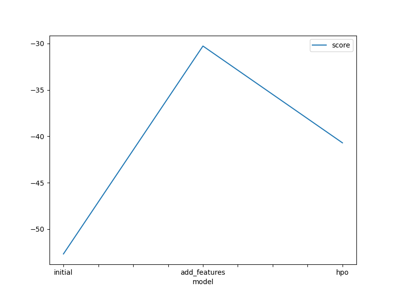
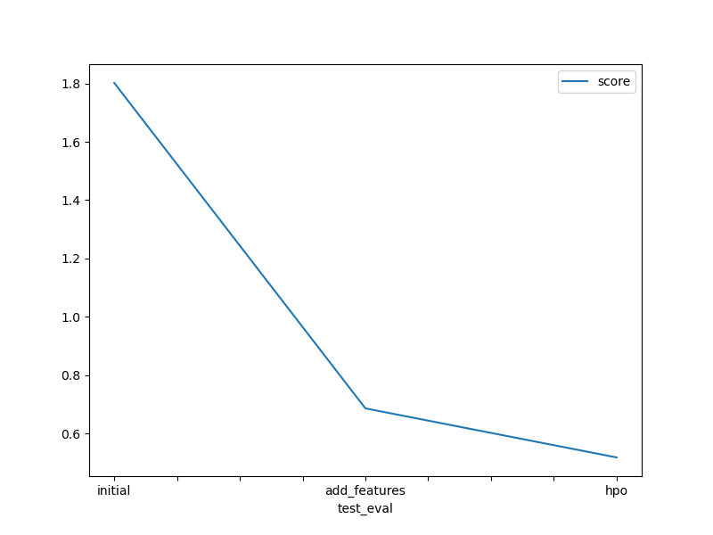

# Report: Predict Bike Sharing Demand with AutoGluon Solution
#### Adam Arnon

## Initial Training
### What did you realize when you tried to submit your predictions? What changes were needed to the output of the predictor to submit your results?
Answer: That I needed to get rid of the negative values in the predictions.

### What was the top ranked model that performed?
Answer: The top ranked model was the WeightedEnsemble_L3 model. It scored 1.80174 on kaggle.

## Exploratory data analysis and feature creation
### What did the exploratory analysis find and how did you add additional features?
Answer: The exploratory analysis found that the temperature and humidity had a strong correlation with the hour, and to a lesser extent with month and year. I added those features be extracting them from datetime.

### How much better did your model preform after adding additional features and why do you think that is?
Answer: The model performed better after adding the features. The new model scored 0.68609 as compared to 1.80174 for the initial model. The model could obviously better predict the demand with the new features. Especially the hour feature, which makes a lot of sense.  

## Hyper parameter tuning
### How much better did your model preform after trying different hyper parameters?
Answer: The model scored 0.51797 after tuning the hyperparameters. This is a nice improvement over the previous models.

### If you were given more time with this dataset, where do you think you would spend more time?
Answer: I would have looked into the impacts of combining features, like humidity, temperature and windspeed, to see if that could have improved the model further. 

### Create a table with the models you ran, the hyperparameters modified, and the kaggle score.
Here are the hyperparameters used. I think it's more informative

| run_name | model               |   score_val |   fit_time_marginal |   num_features | model_type            | child_model_type            | hyperparameters                                                                                            | ag_args_fit                                                                                                                                                                                                                                                                                                                                                                         | features                                                                            | child_hyperparameters   | child_ag_args_fit                                                                                                                                                                                                                                                                                                                                                                   | ancestors                                                                                                                                                                                                                                                                                                |   kaggle_score |
|:--------------------|------------:|--------------------:|---------------:|:----------------------|:----------------------------|:-----------------------------------------------------------------------------------------------------------|:------------------------------------------------------------------------------------------------------------------------------------------------------------------------------------------------------------------------------------------------------------------------------------------------------------------------------------------------------------------------------------|:------------------------------------------------------------------------------------|:------------------------|:------------------------------------------------------------------------------------------------------------------------------------------------------------------------------------------------------------------------------------------------------------------------------------------------------------------------------------------------------------------------------------|:----------------------------------------------------------------------------------------------------------------------------------------------------------------------------------------------------------------------------------------------------------------------------------------------------|:-------------|---------------:|
| initial      | WeightedEnsemble_L3 |    -52.6843 |            0.232587 |              4 | WeightedEnsembleModel | GreedyWeightedEnsembleModel | {'use_orig_features': False, 'max_base_models': 25, 'max_base_models_per_type': 5, 'save_bag_folds': True} | {'max_memory_usage_ratio': 1.0, 'max_time_limit_ratio': 1.0, 'max_time_limit': None, 'min_time_limit': 0, 'valid_raw_types': None, 'valid_special_types': None, 'ignored_type_group_special': None, 'ignored_type_group_raw': None, 'get_features_kwargs': None, 'get_features_kwargs_extra': None, 'predict_1_batch_size': None, 'temperature_scalar': None, 'drop_unique': False} | ['LightGBM_BAG_L2', 'CatBoost_BAG_L2', 'ExtraTreesMSE_BAG_L2', 'LightGBMXT_BAG_L2'] | {'ensemble_size': 100}  | {'max_memory_usage_ratio': 1.0, 'max_time_limit_ratio': 1.0, 'max_time_limit': None, 'min_time_limit': 0, 'valid_raw_types': None, 'valid_special_types': None, 'ignored_type_group_special': None, 'ignored_type_group_raw': None, 'get_features_kwargs': None, 'get_features_kwargs_extra': None, 'predict_1_batch_size': None, 'temperature_scalar': None, 'drop_unique': False} | ['LightGBM_BAG_L2', 'CatBoost_BAG_L2', 'NeuralNetFastAI_BAG_L1', 'RandomForestMSE_BAG_L2', 'KNeighborsUnif_BAG_L1', 'LightGBM_BAG_L1', 'CatBoost_BAG_L1', 'KNeighborsDist_BAG_L1', 'ExtraTreesMSE_BAG_L2', 'RandomForestMSE_BAG_L1', 'ExtraTreesMSE_BAG_L1', 'LightGBMXT_BAG_L1', 'XGBoost_BAG_L1'] |        1.80174 |
| add_features | WeightedEnsemble_L3 |    -30.2716 |            0.271076 |              4 | WeightedEnsembleModel | GreedyWeightedEnsembleModel | {'use_orig_features': False, 'max_base_models': 25, 'max_base_models_per_type': 5, 'save_bag_folds': True} | {'max_memory_usage_ratio': 1.0, 'max_time_limit_ratio': 1.0, 'max_time_limit': None, 'min_time_limit': 0, 'valid_raw_types': None, 'valid_special_types': None, 'ignored_type_group_special': None, 'ignored_type_group_raw': None, 'get_features_kwargs': None, 'get_features_kwargs_extra': None, 'predict_1_batch_size': None, 'temperature_scalar': None, 'drop_unique': False} | ['LightGBM_BAG_L2', 'CatBoost_BAG_L2', 'ExtraTreesMSE_BAG_L2', 'LightGBMXT_BAG_L2'] | {'ensemble_size': 100}  | {'max_memory_usage_ratio': 1.0, 'max_time_limit_ratio': 1.0, 'max_time_limit': None, 'min_time_limit': 0, 'valid_raw_types': None, 'valid_special_types': None, 'ignored_type_group_special': None, 'ignored_type_group_raw': None, 'get_features_kwargs': None, 'get_features_kwargs_extra': None, 'predict_1_batch_size': None, 'temperature_scalar': None, 'drop_unique': False} | ['LightGBM_BAG_L2', 'CatBoost_BAG_L2', 'LightGBM_BAG_L1', 'KNeighborsUnif_BAG_L1', 'CatBoost_BAG_L1', 'KNeighborsDist_BAG_L1', 'ExtraTreesMSE_BAG_L2', 'RandomForestMSE_BAG_L1', 'ExtraTreesMSE_BAG_L1', 'LightGBMXT_BAG_L2', 'LightGBMXT_BAG_L1']                                                   |        0.68609 |
| hpo          | WeightedEnsemble_L3 |    -30.2716 |            0.271076 |              4 | WeightedEnsembleModel | GreedyWeightedEnsembleModel | {'use_orig_features': False, 'max_base_models': 25, 'max_base_models_per_type': 5, 'save_bag_folds': True} | {'max_memory_usage_ratio': 1.0, 'max_time_limit_ratio': 1.0, 'max_time_limit': None, 'min_time_limit': 0, 'valid_raw_types': None, 'valid_special_types': None, 'ignored_type_group_special': None, 'ignored_type_group_raw': None, 'get_features_kwargs': None, 'get_features_kwargs_extra': None, 'predict_1_batch_size': None, 'temperature_scalar': None, 'drop_unique': False} | ['LightGBM_BAG_L2', 'CatBoost_BAG_L2', 'ExtraTreesMSE_BAG_L2', 'LightGBMXT_BAG_L2'] | {'ensemble_size': 100}  | {'max_memory_usage_ratio': 1.0, 'max_time_limit_ratio': 1.0, 'max_time_limit': None, 'min_time_limit': 0, 'valid_raw_types': None, 'valid_special_types': None, 'ignored_type_group_special': None, 'ignored_type_group_raw': None, 'get_features_kwargs': None, 'get_features_kwargs_extra': None, 'predict_1_batch_size': None, 'temperature_scalar': None, 'drop_unique': False} | ['LightGBM_BAG_L2', 'CatBoost_BAG_L2', 'LightGBM_BAG_L1', 'KNeighborsUnif_BAG_L1', 'CatBoost_BAG_L1', 'KNeighborsDist_BAG_L1', 'ExtraTreesMSE_BAG_L2', 'RandomForestMSE_BAG_L1', 'ExtraTreesMSE_BAG_L1', 'LightGBMXT_BAG_L2', 'LightGBMXT_BAG_L1']                                                  |        0.51797 |

### Create a line plot showing the top model score for the three (or more) training runs during the project.

TODO: Replace the image below with your own.

### Create a line plot showing the top kaggle score for the three (or more) prediction submissions during the project.

TODO: Replace the image below with your own.

## Summary
Answer: The model improved from 1.80174 to 0.51797 after adding features and tuning hyperparameters. The model could better predict the demand with the new features. Especially the hour feature, which makes a lot of sense. The model could be further improved by combining features, like humidity, temperature and windspeed. It was fun playing with sagemaker and seeing how easy it is to connect a notebook to a repo and use the resources you need to complete a project.
