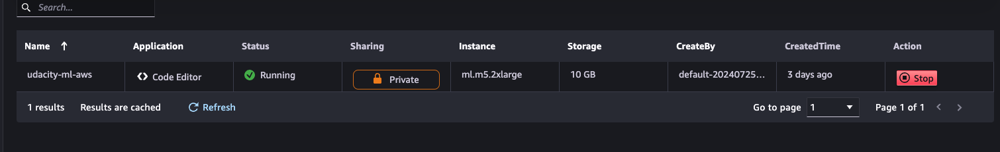
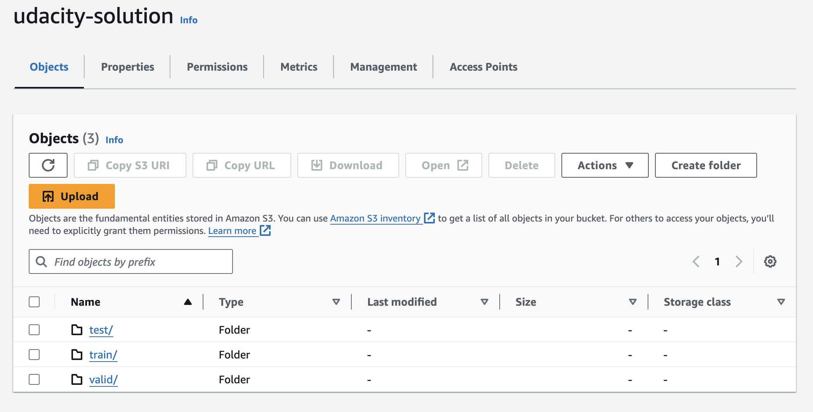
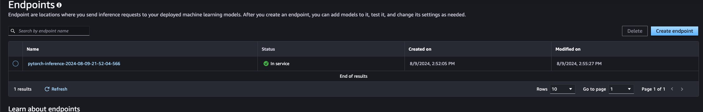
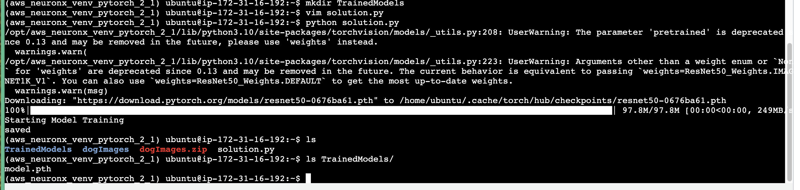
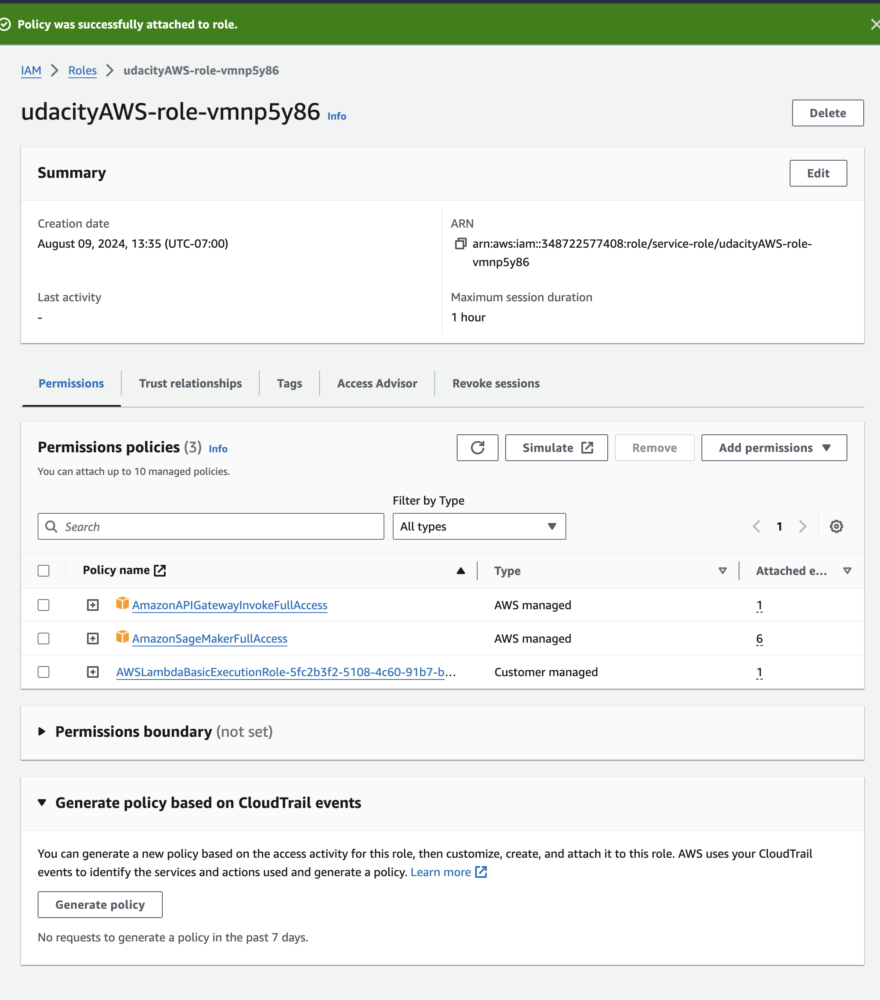
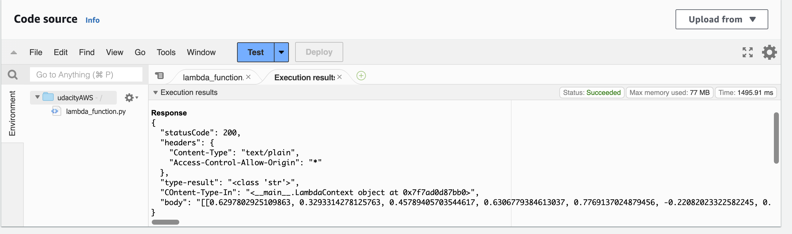
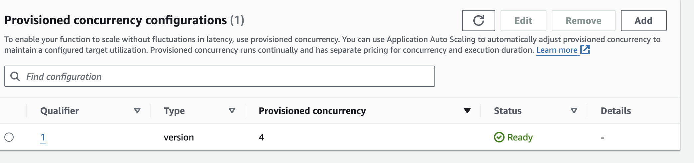
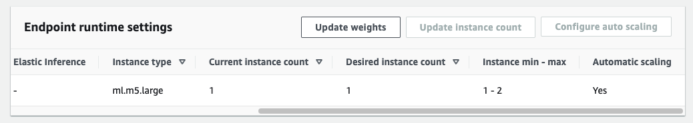

# Deploying a Model in SageMaker

## Project Summary
### In this project, you will complete the following steps:

1. Train and deploy a model on Sagemaker, using the most appropriate instances. Set up multi-instance training in your Sagemaker notebook.
2. Adjust your Sagemaker notebooks to perform training and deployment on EC2.
3. Set up a Lambda function for your deployed model. Set up auto-scaling for your deployed endpoint as well as concurrency for your Lambda function.
4. Ensure that the security on your ML pipeline is set up properly.

## The goal of this project is to familiarize with 
* Managing computing resources efficiently
* Training models with large datasets using multi-instance training
* Setting up high-throughput, low-latency pipelines
* AWS security


## Step 1: Training and deployment on Sagemaker
First, I chose a ml.m5.2xlarge sagemaker instance. There is no need for gpu instances, since the training will be done in containers, separate from this instance, but I still wanted an instance that would have enough cpu power and memory to do EDA easily. I set the memory to have 10 GB, just in case:


I first set a bucket in s3 named "udacity-solution" and uploaded the data to it. Here is the proof:


For the training instance type I chose ml.g5.2xlarge instance, as it is a relatively cheap, yet powerful, instance,  for deep learning tasks. I set 2 instances and ran 2 jobs on each one, for 4 jobs in parallel, in total. 

I then deplpoyed the best model to an endpoint. Since the point really wasn't to get a great model, I only trained all of the models for 1 epoch, and then selected the model with the lowest validation loss.



## Step 2: Training and deployment on EC2

I wanted to create an EC2 instance of type ml.g5.2xlarge, as it is a relatively cheap, yet powerful, instance,  for deep learning tasks. Unfortunately, my account doesn't have the permission to create an instance of this type. I put a request on "Service Quotas", yet it took too much time to get a response. I then decided to go with the inf1.2xlarge instance, should be at least better than cpu instances for this task.

For the platform, I chose the Deep Learning AMI Neuron (Ubuntu 22.04) 20240722, as it seemed the best choice when no cuda is available.

I then copied the training script from the sagemaker notebook to the EC2 instance, and ran it.



The code of the ec2 training script is very similar to the sagemaker one, with the main difference being that the configuration variables are set in the script itself, or via the terminal in a totally explicit way, as opposed to the sagemaker notebook, where the env can be set differently.


## Step 3: Lambda function
Next, I set up a lambda function, which is triggered by an S3 event. I used the lambdafunctions.py file to create the lambda function, and changed the endpoint_name variable to the endpoint name of the model I deployed in step 1.


## Step 4: Security and Testing

I added the role AmazonSageMakerFullAccess to the lambda function, as it didn't work without it.



I then tested the lambda function by uploading a file to the s3 bucket.



The result of the test was: 
```json
Test Event Name
myTest

Response
{
  "statusCode": 200,
  "headers": {
    "Content-Type": "text/plain",
    "Access-Control-Allow-Origin": "*"
  },
  "type-result": "<class 'str'>",
  "COntent-Type-In": "<__main__.LambdaContext object at 0x7fb1c15d8bb0>",
  "body": "[[0.6297802925109863, 0.3293314278125763, 0.45789405703544617, 0.6306779384613037, 0.7769137024879456, -0.22082023322582245, 0.23206999897956848, -0.027715792879462242, 0.12845279276371002, 0.42114734649658203, 0.6617460250854492, -0.054620761424303055, 0.430001437664032, 0.5119268298149109, 0.6028012633323669, 0.3748159408569336, 0.23194478452205658, 0.4813312888145447, 0.3776552081108093, 0.1300138533115387, 0.5674204230308533, -0.04874423146247864, 0.5960780382156372, 0.6576759815216064, 0.2280842661857605, 0.26810768246650696, 0.7153933048248291, 0.12021997570991516, 0.7798362374305725, 0.4736146926879883, 0.4709976315498352, 0.20257540047168732, 0.4148823916912079, 0.7025467753410339, 0.03860458731651306, 0.6817301511764526, 0.5314885973930359, 0.49367380142211914, 0.6076494455337524, 0.4528869688510895, 0.5172277092933655, 0.6404508948326111, 0.3927697539329529, 0.6794685125350952, 0.49992844462394714, 0.5499923229217529, 0.5634965896606445, 0.5262268781661987, 0.3197278380393982, 0.4490785300731659, 0.4198267161846161, 0.39366111159324646, 0.3493841886520386, 0.5171487927436829, 0.44054797291755676, 0.5492742657661438, 0.617409348487854, 0.18620117008686066, 0.38490527868270874, 0.6679016947746277, 0.42325419187545776, 0.4416261911392212, 0.5132385492324829, 0.0347960963845253, 0.26980918645858765, 0.21062326431274414, 0.16982775926589966, 0.2981502413749695, 0.37676531076431274, 0.3639320135116577, 0.5769997835159302, 0.4366559684276581, 0.21939781308174133, 0.2465018481016159, 0.34459051489830017, 0.02913842163980007, 0.2767384350299835, 0.24094191193580627, 0.47435060143470764, -0.08685047179460526, 0.5377787947654724, 0.07290863245725632, 0.023134499788284302, 0.25775736570358276, 0.2578189969062805, 0.3687511086463928, 0.013764390721917152, 0.3528074622154236, 0.40659013390541077, 0.591118574142456, 0.5564690828323364, 0.4317888617515564, 0.1300196498632431, 0.3504610061645508, 0.4814358949661255, 0.35586729645729065, 0.262257844209671, 0.22680136561393738, 0.2936628460884094, 0.1512177586555481, 0.393404096364975, 0.0020525548607110977, 0.547160804271698, 0.06365575641393661, 0.10187987238168716, 0.40184345841407776, 0.3707684278488159, -0.05424417555332184, 0.25017476081848145, 0.06921365857124329, 0.36591583490371704, 0.4954676032066345, -0.019653121009469032, 0.11507701128721237, 0.5893517732620239, 0.08548765629529953, 0.32417792081832886, 0.33338141441345215, 0.05440925806760788, 0.26686710119247437, 0.09761891514062881, 0.1283581256866455, 0.37782052159309387, 0.36660024523735046, 0.09102628380060196, 0.024392370134592056, 0.3088185787200928, -0.05053021013736725, 0.40165022015571594, 0.3552660644054413, 0.003056512214243412, -0.04648718237876892, 0.09465741366147995]]"
}

Function Logs
Loading Lambda function
START RequestId: 838a5f04-da94-42e0-9480-0c3c64c530d4 Version: $LATEST
Context::: <__main__.LambdaContext object at 0x7fb1c15d8bb0>
EventType:: <class 'dict'>
END RequestId: 838a5f04-da94-42e0-9480-0c3c64c530d4
REPORT RequestId: 838a5f04-da94-42e0-9480-0c3c64c530d4	Duration: 1700.76 ms	Billed Duration: 1701 ms	Memory Size: 128 MB	Max Memory Used: 77 MB	Init Duration: 396.31 ms

Request ID
838a5f04-da94-42e0-9480-0c3c64c530d4
```

I'm not sure if the work space is totally secure. I think that the blanket AmazonSageMakerFullAccess role is too broad. I think that I should have created a custom role that only allows the lambda function to access the endpoint, and not the whole SageMaker service.

## Step 5: Concurrency and Autoscaling

I set up provisioned concurrency to 4, for no particular reason.


I set up autoscaling to scale up to 2 instances, and scale down to 1 having scale in cool down of 10 seconds and scale out cool down of 10 seconds. I don't expect much traffic, so if I get some, it's probably because of some random social media post, which means I would have to scale fast.

